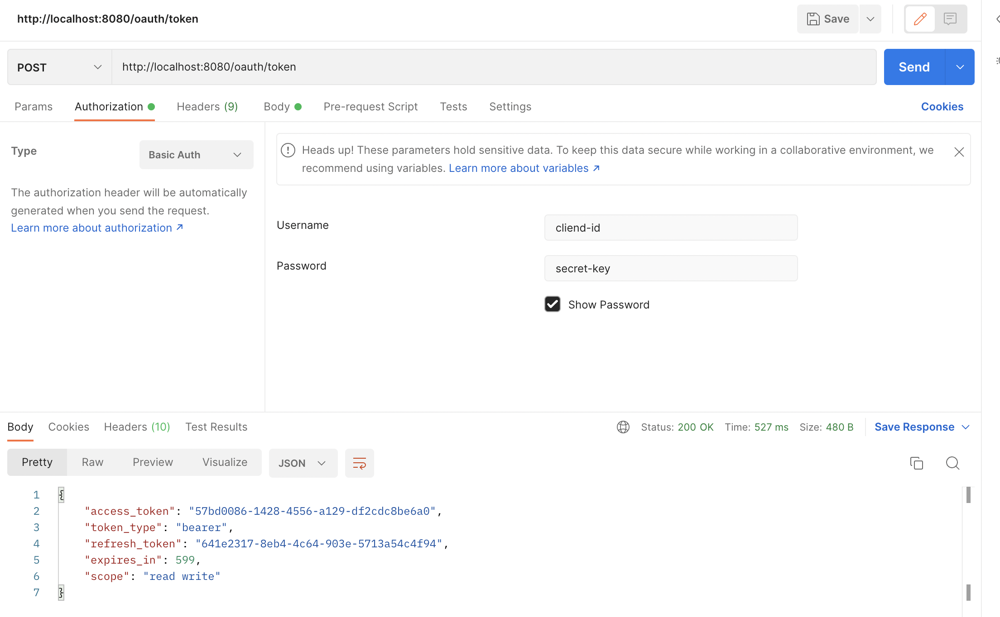
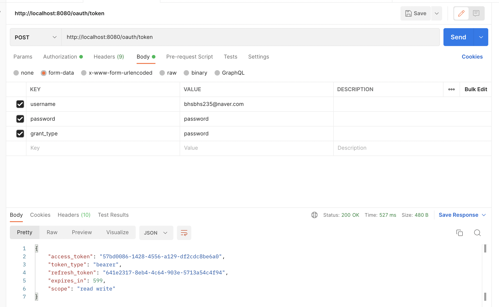
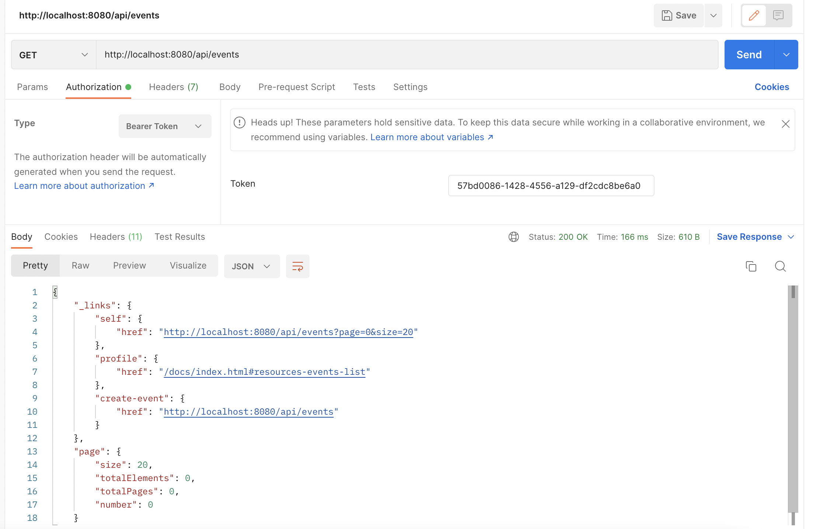

출처
---
인프런 백기선 (스프링 기반 REST API 개발)

# REST API

- [그런 REST API로 괜찮은가?](https://deview.kr/2017/schedule/212?lang=ko) 를 참고해 Self-Describtive Message와 HATEOAS 제 조건을 만족하는 REST API를 개발
- TDD 포함

# 개발상세

- asciidoctor-maven-plugin 플러그인으로 generated-docs 디렉토리에 index.adoc 템플릿을 이용해 index.html 파일 생성
- maven-resources-plugin 플러그인으로 resource 파일 ${project.build.directory}/generated-docs 파일을 ${project.build.outputDirectory}/static/docs로 옮겨줌 스프링부트 기능으로 서버 실행하면 static/docs/index.html 페이지 접근 가능

# POSTMAN 테스트

- Authorization "Basic Auth" 선택 후 properties 파일의 "my-app.client-id", "my-app.client-secret" 값을 넣는다.

- user 아이디,패스워드 입력 gret_type은 "password"로 해준다

- 발급받은 "access_token" 값을 Authorization에 Barer Token 선택 후 넣어준다 그러면 인증이 완료되었기 때문에 API 요청한 값이 출력된다.
